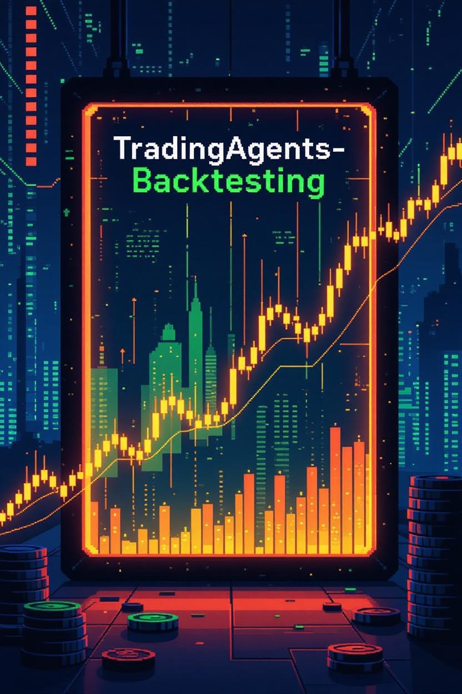

# TradingAgents-Backtesting

A Multi-Agent framework based on Large Language Models (LLM) for stock analysis and trading strategy backtesting.
This project is adapted from the well-known `hsliuping/TradingAgents-CN`, simplifying data sources and adding the functionality to generate and backtest trading strategies based on analytical reports.



---

## 🌟 Key Features

*   **🤖 Multi-Agent Collaboration**: Simulates a professional investment research team, including roles like market analysts, fundamental analysts, technical analysts, risk managers, and traders, who collaborate to conduct in-depth stock analysis.
*   **🔌 Pluggable LLM Support**: Easily integrate and switch between various Large Language Models. Currently supports OpenAI (GPT series), Google (Gemini), DeepSeek, and Alibaba Qwen (Dashscope).
*   **📊 Rich Data Sources**: Integrates multiple real-time and historical data sources, including `Akshare`, `Google News`, and `Reddit`, covering major markets like China A-shares, Hong Kong stocks, and US stocks.
*   **🚀 Strategy Generation & Backtesting**: Automatically generates trading strategies based on AI analysis and uses a built-in backtesting engine to evaluate their effectiveness with historical data.
*   **💻 Dual Interfaces**:
    *   **Web UI**: A modern and user-friendly graphical interface based on Streamlit.
    *   **CLI**: A powerful command-line interface for automation and integration.
*   **🐳 One-Click Docker Deployment**: Provides `Dockerfile` and `docker-compose.yml` for one-click build and deployment, greatly simplifying the environment setup process.
*   **📝 Detailed Analysis Reports**: Automatically generates structured analysis reports (in Markdown or JSON format) that clearly present the analysis process and conclusions.

---

## 🛠️ Installation and Setup

### 1. Clone the Project

```bash
git clone https://github.com/ARROKOTHH/TradingAgents-Backtesting.git
cd TradingAgents-Backtesting
```

### 2. Environment Preparation

Python 3.11 is recommended. You can use tools like [conda](https://github.com/conda/conda) to manage your Python versions.

### 3. Install Dependencies

```bash
pip install -r requirements.txt
```

### 4. Configure Environment Variables

Copy the example environment file and fill in your API keys and other necessary information.

```bash
# On Windows
copy .env.example .env

# On macOS/Linux
cp .env.example .env
```

Then, edit the `.env` file to add your LLM API keys and other required configurations.

---

### 🚀 Quick Start

You can run the project via the Web UI or the CLI.

#Starting the Web UI

Execute the following command to launch the graphical interface:
For web UI
```bash
streamlit run web/app.py
```
After launching, open `http://localhost:8501` in your browser to get started.

#Starting the CLI
Execute the following command to launch the command-line interface:
```bash
python cli/main.py
```
#You can view all available commands and options using the `--help` flag:
```bash
python cli/main.py --help
```

---

## 🐳 Docker Deployment (Recommend)

If you prefer to run the application using Docker, a `docker-compose.yml` file is provided.

1.  **Ensure Docker and Docker Compose are installed.**
2.  **Make sure your `.env` file is properly configured.**

Then, run the following command to build and start the services:

```bash
docker-compose up --build -d
```

The service will run in the background. You can view the logs with:

```bash
docker-compose logs -f
```

---
## 🚮 Clean the project cache
 ```bash
# On windows
run /clean_project_for_Win.bat

#On MacOS/Linux
chmod +x /clean_project.sh
/clean_project.sh
```
---
## 📁 Project Structure Overview

```
.
├── tradingagents/    # Core code directory
│   ├── agents/       # Definitions for various agents
│   ├── config/       # Configuration management
│   ├── dataflows/    # Data flow and data source management
│   ├── graph/        # Agent collaboration graph (workflow)
│   ├── llm_adapters/ # LLM adapters
│   └── tools/        # Tools used by the agents
├── web/              # Web UI (Streamlit) related code
├── cli/              # CLI related code
├── Backtesting/      # Backtesting engine
├── Strategy/         # Directory for saved strategy files
├── analysis reports/ # Directory for saved analysis reports
├── requirements.txt  # Python dependencies
├── docker-compose.yml# Docker orchestration file
└── README.md         # This document
```

---

## 📄 License

This project is licensed under the [MIT License](LICENSE).

